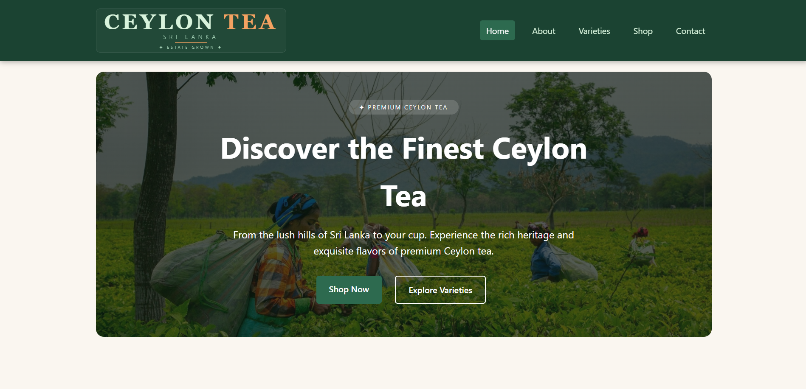

# 🍃 Ceylon Tea Website

<p align="center">
  
</p>

<p align="center">
  <strong>A modern, responsive static website showcasing the heritage, varieties, and experience of authentic Ceylon Tea.</strong>
</p>

<p align="center">
  
  
  
</p>

---

## 🌐 Live Website

👉 **https://pmadhuwantha12.github.io/Ceylon_Tea/**

---

# 📖 About The Project

The **Ceylon Tea Website** is a fully responsive static website developed using **HTML5, CSS3, and Vanilla JavaScript**. It promotes Sri Lanka's world-famous Ceylon Tea through an elegant, user-friendly interface featuring tea varieties, company information, an interactive shop, customer reviews, and contact functionality.

The project demonstrates modern front-end web development practices including responsive layouts, semantic HTML, clean CSS architecture, and JavaScript-powered interactivity.

---

# ✨ Features

-  Responsive Home Page
-  About Ceylon Tea
-  Explore 8 Tea Varieties
-  Interactive Shop & Order Form
-  Contact Form with Validation
-  Customer Reviews Section
-  Tea Knowledge Quiz Preview
-  Mobile-Friendly Responsive Design
-  Smooth Navigation
-  Modern UI Design

---

## 🛠️ Technologies Used

### Core Technologies

| Technology | Purpose | Key Applications |
|------------|---------|------------------|
| **HTML5** | Structure | Semantic elements, accessible forms, SEO-friendly markup |
| **CSS3** | Styling | Flexbox, CSS Grid, Media Queries, Transitions, Custom Properties |
| **JavaScript (ES6+)** | Interactivity | DOM manipulation, event handling, form logic, dynamic content |

### Tools & Platforms

| Tool | Purpose |
|------|---------|
| **Git** | Version control |
| **GitHub** | Repository hosting & collaboration |
| **GitHub Pages** | Live deployment & hosting |
| **Font Awesome** | Professional icons |
| **Google Fonts** | Typography (Segoe UI, Georgia) |

---

# 📂 Project Structure

```text
Ceylon-Tea-Website/
│
├── 📄 index.html          # Home — hero, features, quiz preview, reviews
├── 📄 about.html          # About — history, mission, brand values
├── 📄 varieties.html      # Varieties — 8 tea types with profiles
├── 📄 shop.html           # Shop — interactive multi-item order form
├── 📄 contact.html        # Contact — form with validation
│
├── 📁 css/
│   └── style.css          # Complete styling & responsive design
│
├── 📁 js/
│   └── script.js          # All interactivity & business logic
│
└── 📁 images/
    ├── hero-tea.jpg
    ├── black-tea.jpg
    ├── green-tea.jpg
    ├── white-tea.jpg
    ├── oolong-tea.jpg
    ├── chai-spice.jpg
    ├── green-tea-curls.jpg
    ├── big-leaf-black-tea.jpg
    ├── ginger-lemongrass.jpg
    └── tea-garden.jpg
```

---

# 📄 Website Pages

| Page | Description |
|-------|-------------|
| 🏠 Home | Hero section, featured teas, reviews, quiz preview |
| 📖 About | History of Ceylon Tea, mission and values |
| 🍃 Varieties | Eight premium tea varieties with descriptions |
| 🛒 Shop | Interactive tea ordering system |
| 📩 Contact | Contact form with client-side validation |

---

# 📱 Responsive Design

The website is optimized for:

- 💻 Desktop
- 💼 Laptop
- 📱 Mobile
- 📟 Tablet

---

# 🚀 Getting Started

Clone the repository

```bash
git clone https://github.com/Pmadhuwantha12/Ceylon_Tea.git
```

Open the project folder and launch:

```text
index.html
```

No installation or additional dependencies are required.

---

# 🎯 Learning Outcomes

This project demonstrates:

- Semantic HTML5
- Responsive Web Design
- CSS Flexbox & Grid
- JavaScript DOM Manipulation
- Form Validation
- Multi-page Website Architecture
- User Experience (UX) Principles
- Clean Folder Organization

---

# 👨‍💻 Author

**R. L. Pasan Madhuwantha**

- GitHub: https://github.com/Pmadhuwantha12
- Portfolio: https://pmadhuwantha12.github.io/Ceylon_Tea/

---

# 📜 License

This project was developed for academic purposes as part of the **Internet and Web Technologies (ICT 142-3)** course at **Uva Wellassa University of Sri Lanka**.

---

## ⭐ If you like this project, consider giving it a Star!
